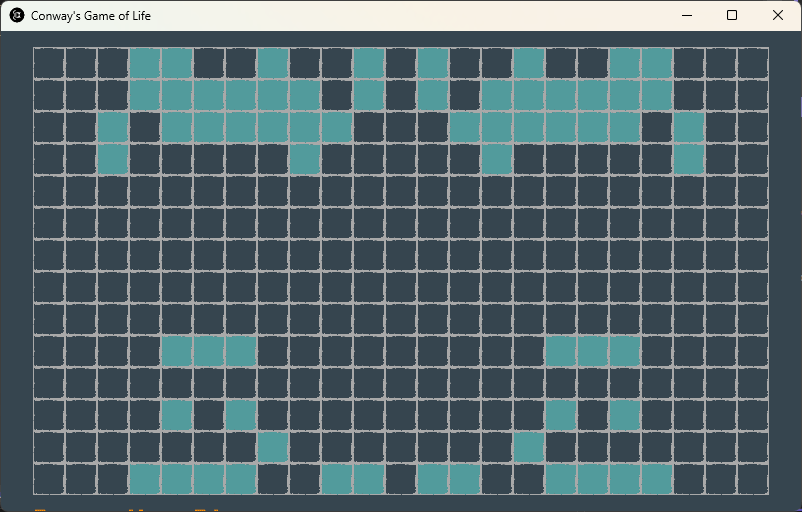

# game-of-life

</img>  

[Conway's Game of Life](https://en.wikipedia.org/wiki/Conway%27s_Game_of_Life), also known simply as Life, is a cellular automaton devised by the British mathematician John Horton Conway in 1970. It is a zero-player game, meaning that its evolution is determined by its initial state, requiring no further input. One interacts with the Game of Life by creating an initial configuration and observing how it evolves. It is Turing complete and can simulate a universal constructor or any other Turing machine. 

Rules:
1. Any live cell with fewer than two live neighbors dies, as if by underpopulation.
2. Any live cell with two or three live neighbors lives on to the next generation.
3. Any live cell with more than three live neighbors dies, as if by overpopulation.
4. Any dead cell with exactly three live neighbors becomes a live cell, as if by reproduction.

---

## Running

The game logic is implemented in [World class](/src/Domain/World.cs).

The game can be run on the command line or using a native application.

### [console](/src/Console/)

References:
- [Spectre.Console](https://spectreconsole.net/)

### [game](/src/Conway/)

References:
- [Monogame](https://monogame.net/)